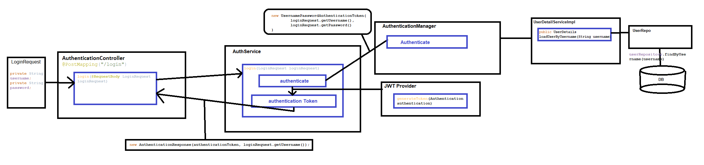

#Spring Reddit Clone Demo with Angular

##Description
My Personal Side project of Reddit Clone Application used with Spring Boot and Angular  

#Part 1 - Entities and Repositories
1. @Entity/Java classes to represent the each data tables in PostgreSQL 'reddit' db server  
 1. User.java  
 2. Comment.java  
 3. Post.java  
 4. Subreddit.java  
 5. VerificationToken.java  
 6. Vote.java  
2. Repositories for each Entity java class  
 1. UserRepository.java  
 2. CommentRepository.java  
 3. PostRepository.java  
 4. SubredditRepository.java  
 5. VerificationTokenRepository.java  
 6. VoteRepository.java  

#Part 2 - Security, Registration, and Email Verification  
  

1. SecurityConfig configures to allow all the requests which match the endpoint “/api/auth/**”  
2. AuthController manages http requests/REST API between client and server for registering a person  
3. AuthService calls to generate verification token and setup the link with generated token to send the api for email  
4. MailService sends out the email  

#Part 3 - Login  
 
1. The login request is received by AuthenticationController and is passed on to the AuthService class.  
2. This class creates an object of type UserNamePasswordAuthenticationToken which encapsulates the username and password provided by the user as part of the login request.  
3. Then this is passed on to AuthenticationManager which takes care of the authentication part when using Spring Security. It implements lot of functionality in the background and provides us nice API we can use.  
4. The AuthenticationManager further interacts with an interface called UserDetailsService, this interface as the name suggests deals with user data. There are several implementations that can be used depending on the kind of authentication we want.  
5. As we store our user information inside the Database, we used Database authentication, so the implementation access the database and retrieves the user details and passes UserDetails back to AuthenticationManager.
6. The AuthenticationManger now checks the credentials, and if they match it creates an object of type Authentication and passes it back to the AuthService class.
7. Then we create the JWT and respond back to the user.

